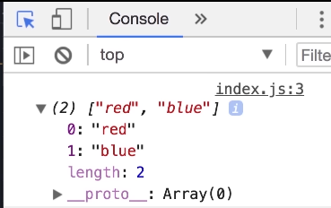

We'll create a new file named index.js.
```js
console.log('hello world');

```

Run this in node using cmd by this command 
```bash
node index.js
```

You can also run this on integrated terminal on vscode. Node comes next , first we learn basics of the language.


### Variables

\
Boxes with labels - an analogy for the variable.

```js
// going forward from ES6 and later , we use let instead of var
let name;
console.log(name);
```

Console returns
```
undefined
```
Lets define our first variable
```js
let name = 'daksesh';
console.log(name);

// Output > daksesh
```

We cannot use reserved words as names for a variable
```js
let if = "some name";
// Throws an error 
```

Lets also have meaningful names and follow conventions , use meaningful and descriptive names.\
Also we cannot start a name with a number .\
Spaces are not allowed .\
Know about camel notation.


```js
let firstName , lastName; // for variables use camel notation
const GRAV_CONST , DEBROGLIE_CONST ; // for constants use upper case snake case
```
[For more things about casings](https://www.freecodecamp.org/news/snake-case-vs-camel-case-vs-pascal-case-vs-kebab-case-whats-the-difference/) follow the link.


### Constants
Used where we want the engine to throw an error when we try to change a constant by mistake.
```js
const INTEREST_RATE = 0.3;
INTEREST_RATE = 1;
// Throws Error 
//> TypeError: Assignment to constant variable. at index.js:3
```

### Types 
Primitive Types 
- String
- Number
- Boolean
- undefined
- null


```js
let name = 'daksesh'; // is a string literal
let number = 23; // is a number literal 
let isAgreedUpon = false; // is a boolean literal
let lastName = undefined; // 
let lastName = null; // used for explicitly clearing the value of a variable
```

null represents absense of value whereas undefined meaning the value is not assigned, for example

```js
let name;
// name has the value undefined
let name = null;
// now the name has the value null
```

### Dynamic Typing 
This is a feature that JavaScript has , that offers flexibility over the type of variable with the let keyword.
[Go the w3schools for more clarity.](https://www.w3schools.com/js/js_typeof.asp) 

```js
let name = 'daksesh'; 
let number = 23;
let isAgreedUpon = false; 
let lastName = undefined; 
let colorSelected = null; 
/*
Console
-----------------
> typeof name
< "string"
-----------------
> name = 1;
< 1
-----------------
> typeof name
< "number"
-----------------
*/

```
Above example demonstrates the dynamic typing capabilities of the JavaScript . Also note that all types of numbers are numbers in javascript unlike other languages.

```js
/* Console
-----------------
> typeof age
< "number
-----------------
> age = 30.1
< 30.1
-----------------
> typeof age
< "number"
-----------------
*/
```
Note that the 'undefined' assignment also sets the type to undefined.

```js
/* Console
-----------------
> typeof lastName
< "undefined"
-----------------
> typeof colorSelected
< "object"
*/

```
Undefined is a type and value in javascript. The last typeof is explained in the next section.


Reference Types are as follows:
- Object
- Array ( yes Array is a reference type in JavaScript)
- Function ( is also a reference type in JavaScript)

Next section is about the reference type "Object".

### Objects
Like any other language , objects are used for implementing [abstraction](https://en.wikipedia.org/wiki/Abstraction_(computer_science)) and [Encapsulation](https://en.wikipedia.org/wiki/Encapsulation_(computer_programming)).The same idea follows up in JavaScript, where we can create Abstractions by making variables as properties of an Object.

Syntax and examples are below 
```js
// We are creating the Person Object

let person = {
    name : 'daksesh';
    age : 23
}; // {} represents the object literal

console.log(person);

/* Console
-----------------
> {name:"daksesh" , age = 23}
> __proto__: Object
-----------------
*/
```

Dot notation for accessing the variables inside an object.\
Bracket Notation is also used , both have their own uses.

```js
/* Console
-----------------
> person.name
< "daksesh"
-----------------
> person['name'] 
< "daksesh"
-----------------
```
Dot notation easier but Bracket Notation is powerful when the variable name is unknown before runtime.


### Arrays 

```js
let selectedColors = []; // Denotes an array literal 
selectedColors = ['red', 'blue'];
```



Accessing elements in an array using the [] operator 

```js
console.log(selectedColors[0]);

//dynamic length 
selectedColors[2] = 1;
// note that type is not constrained in an array unlike other programs
```

Also, array is an "object" in JavaScript. 

### Functions
Set of statements that does something

```js
function helloworld(name){
//body of the function
console.log(name + "hello");
}
//Since function declaration is not a variable declaration , we need not end it with ';'

// also note that + operator can be used to concatenate strings
```

Lets call the function we wrote

```js
helloworld('daksesh');
/* Console
-----------------
dakseshhello    index.js:3
```
Here , name is the parameter, and the inputted argument for that parameter is 'daksesh'. Now we talk about the 'return' keyword.

```js
function sq(num){
    return num * num;
}

let x = sq(2);
console.log(x);

/* Console
-----------------
4               index.js:12
>

*/
```
This ends our tutorial about basic JavaScript.
